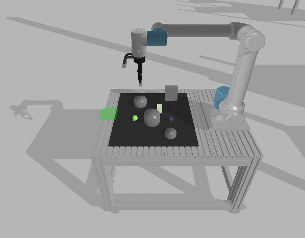

# Project Assignment: Pushing While Avoiding Obstacles

This repository contains the code for the project asigmnment of the robot programming course.

The full requirement and task description can be finde [here](Project_Task.md). Our methodic and problems can be seen [here](methodik.md).



## Quick start

### Environment setup

**Requirements:** have docker installed including the post-installation steps.

**Note:** The default settings are for nvidia GPU support. If you don't have an nvidia GPU, open up `build_image.sh` and set the `render` argument to `base`. Also, remove the `--gpus all` flag from the `docker run` command in `run_container.sh`.

Build the docker image with

```bash
./build_image.sh
```

Run the container with
```bash
./run_container.sh
```
To start the simulation run
```bash
python main.py
```
